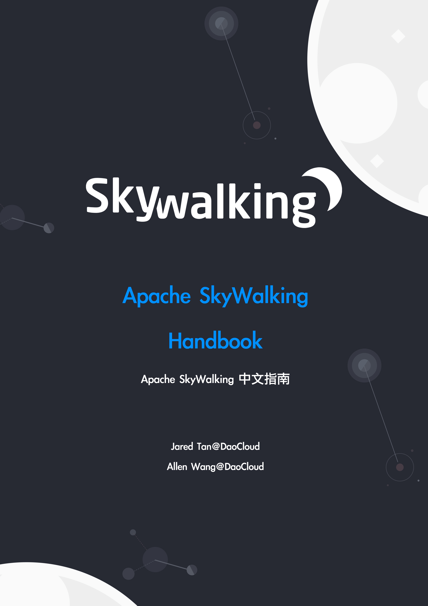

# 前言

本手册将指导你如何使用[Skywalking](https://github.com/apache/skywalking)构建APM系统。

通过此手册你可以了解到所有有关 SkyWalking 的架构, 如何部署并使用 SkyWalking, 以及如何基于 SkyWalking 进行开发。

注意⚠️：基于 Skywalking 最新 8.0.1 版本

在线浏览地址：[https://skywalking-handbook.netlify.com/](https://skywalking-handbook.netlify.com/)

Github地址：[https://github.com/JaredTan95/skywalking-handbook](https://github.com/JaredTan95/skywalking-handbook)

## 目标读者

本文档适用于以下读者：

* 对追踪系统感兴趣
* 打算在公司使用 Skywalking
* 想了解追踪系统以及 Skywalking 内部机制

## 贡献者

感谢此书的[贡献者](https://github.com/JaredTan95/skywalking-handbook/graphs/contributors)。

## 致谢

